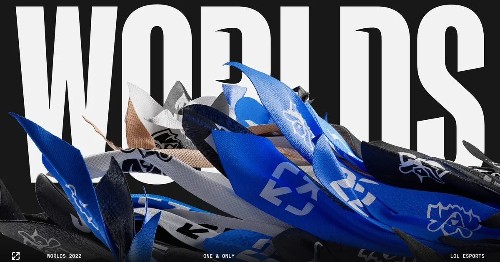
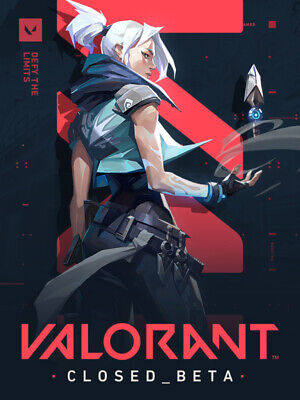
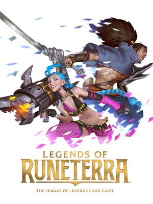
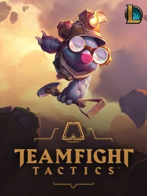
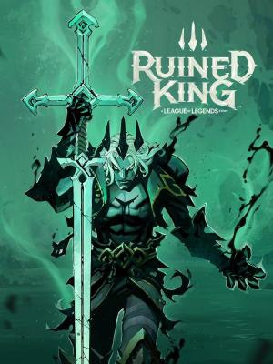

# MartinGomez10.github.io
<html lang="en" dir="ltr">
  <head>
    <meta charset="utf-8">
    <title>Juegos de Riot</title>
    <link rel="stylesheet" href="css/estilos.css"></link>
  </head>
  <body>
    

      <ul>
        <li class="menu"><a>Riot Games</a></li>
        <li class="menu"><a href="#Gm">Juegos</a></li>
        <li class="menu"><a href="#Nw">Noticias</a></li>
      </ul>
    

    
    <h1 id="Gm" class="second-title">Juegos</h1>
    
    
    
    
    
    <h1 id="Nw" class="second-title">Noticias</h1>

    

      <h2>Lil Nas X y Worlds</h2>
      
Con la llega del Words, tambien tenemos otro himno para esta. “
        Star Walking”, cantada por Lil Nas X no muestr el recorrido de las leyendas del competitivo
        mientras nos preparamos para los increibles enfrentamientos en Worlds.
        Ya disponible en Youtube y Spotife! 

      <h2>Nuevo evento: Flor Espiritual</h2>
      
Disfruta ahora del nuevo evento flor espiritual.
        Nuevas skins, emotes, iconos y cromas! Contenido nuevo para League of Legends, Wild Rift y Legends of Runaterra.
        ¿Que esperas para tomar partido entre el bien y el mal?

      <h2>Arcane recibe cuatro premios Emmy®</h2>
      
Nuestra popular serie de Netflix, de Riot Games y Fortiche Productions,
        es la primera PI de un videojuego en ganar un Emmy® a la mejor serie animada.

      <h2>Mes Internacional del Voluntariado de 2022: de São Paulo a Shanghái</h2>
      
Los miembros de Riot de todo el mundo se han reunido para ayudar a sus comunidades locales a pintar murales,
        limpiar las playas, convertirse en mentores y mucho más.

      <h2>Más que una etiqueta: Priscila Queiroz</h2>
      
Para el Mes de la Herencia Latinoamericana, queremos compartir las historias de los miembros de Riot en Riot Unidos.
        La primera es Priscila, que ha hecho de su pasión por construir comunidades su profesión.

      <h2>Lucha libre: Un talento mexicano único para el Mundial 2022</h2>
      
El equipo de Ciudad de México tuvo que responder a la siguiente pregunta:
        ¿Cómo podemos darle la bienvenida al Mundial a México por primera vez?
        Y la respuesta fue muy sencilla: con la lucha libre.

    

    

      <h4>Martin Gomez</h4>
      <h4>N° 91465/3</h4>
      <h4>Tecno multimedial 1 web</h4>
      <a href="https://www.instagram.com/marrtin.gomezz/">Sitio Oficial </a>

    

  </body>
</html>
